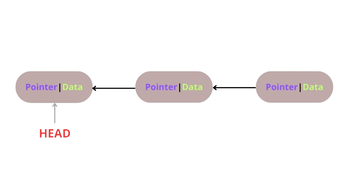

# LinkedList

Linked list is a type of list composed by nodes. Each node contains data and a reference (pointer) to the next node in the list. 

There are different ways to define a linked list based on the reference field:
* Unidirectional references
* Bidirectional references 

In this project, a **right to left** linked list is implemented.
Right to left, as shown in the figure below, refers to the direction of the links. 
In particular, the first node, called _HEAD_, is a standalone node which points to itself, whereas the other nodes keep a 
pointer to the ancestor node. Given a node, we will call the node to its left ancestor and the node to its right successor.

The aim of this project is to build a simple linked list according to the four principles of object-oriented programming.

1. **Encapsulation**: it is the mechanism of hiding data implementation by restricting access to public methods. Instance variables are kept private and accessor methods are made public to achieve this mechanism.
2. **Abstraction**: it refers to the ability to hide complex implementation details and shows only the necessary features of an object.
    1. **Data Abstraction**: it involves displaying only the essential features of an object while hiding the implementation details.
    2. **Process Abstraction**: it focuses on abstracting the behavior or processes of an object. It allows developers to define the methods an object can perform without specifying how these methods are implemented.
3. **Inheritance**: it expresses “is-a” and/or “has-a” relationship between two objects.
4. **Polymorphism**: it means one name many forms. It can be of two types — static and dynamic. Static polymorphism is achieved using method overloading and dynamic polymorphism using method overriding.

Moreover, during the developemnt, the following principles have been taken into account:
* SOLID principle
* DRY principle
* YAGNI principle

The project is made up of two classes, Node and LinkedList. The first one is hidden to the user and is only responsible for managing the data and pointers of each node. The other one deals with managing the structure of the list and provides to the user four methods:

`insert()`: takes a value as input, creates a new node containing the specified value and sets the pointer to the last item of 
            the list.

`remove()`: takes the value to be removed from the list as input, checks for nodes containing such value and removes the first
            node found. After deleting the node, the function sets the pointer of the successor to the ancestor of the removed node.

`insertAt()`: takes a value as input, creates a new node containing the specified value and sets the pointer based on the 
              position_idx. 
              *The position_idx starts from 0*. 